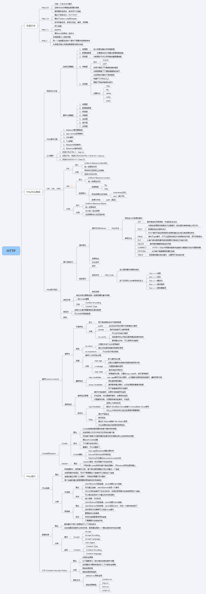

# HTTP
[TOC]
# 前言
从事开发的程序员，不论是前端、后端、移动端，虽然经常跟网络打交道，开发中习惯了使用封装好的网络框架，而不去了解其原理，我相信很多从事开发的程序员对Http的概念了解的不是很清楚，顾本文针对以上问题，稍作总结。

1. [发展历史](#anchor1)
2. [Http协议基础](#anchor2)
3. [Http提升](#anchor3)

<!--more-->

# 内容
## 发展历史
### Http 0.9
1. 只有一个命令GET请求
2. 没有HEADER等描述数据的信息
3. 服务器发送完毕，就关闭TCP连接

### Http 1.0
1. 增加了很多命令：PUT POST 
2. 增加了status code和header
3. 多字符集支持、多部分发送、缓存、权限等

### Http 1.1
1. 持久连接
2. pipeline
3. 增加host和其他一些命令

### Http 2
1. 所有数据以二进制传输
2. 同一个连接里发送多个请求不再要求按照顺序来
3. 头信息压缩以及推送等提高效率的功能

##  Http协议基础
### 网络协议分组
#### 最早七层模型
1. 物理层
2. 数据链路层
3. 网络层
4. 传输层
5. 会话层
6. 表示层
7. 应用层

#### 经典五层模型
##### 物理层
定义物理设备如何传输数据
##### 数据链路层
在通信实体之间建立数据链路链接
##### 网络层
为数据在节点之间传输创建逻辑链路
##### 传输层
1. 向用户提供了可靠端到端的服务
2. 向高层屏蔽了下层数据通信的细节

###### 协议
1. TCP/IP
2. UDP

##### 应用层
1. 为应用软件提供了很多服务
2. 构建于TCP协议之上
3. 屏蔽了网络传输相关细节

###### 主要协议
1. http
2. ftp
3. telnet
4. smtp
### Http请求过程
1. Redirect(是否要跳转)
2. App cache(应用缓存)
3. DNS解析
4. Tcp链接
5. Request(发送请求)
6. Response(接收响应)
### 三次握手
1. 发送SYN(SYN=1，Seq=x)
2. 收到SYN，发送SYN,ACK(SYN=1,ACK=X+1,Seq=y)
3. 发送ACK(ACK=Y+1,Seq=Z)
### URI、URL、URN
#### URI
##### 定义
1. Uniform Resource Identifier
2. 统一资源标识符

##### 作用
1. 用来标识互联网上的信息
2. 包括URL和URN
#### URL
##### 定义
1. Uniform Resource Locator
2. 统一资源定位符

##### 统一资源定位符
1. 资源类型
2. 存放资源的主机域名
3. 资源文件名
#### URN
##### 定义
1. Uniform Resource Name
2. 统一资源名称

##### 作用
1. 永久统一定位资源
2. 在资源移动以后还能找到
### Http报文格式
#### 首行(起始行)
##### 请求报文
###### 请求方法Method
1. GET->请求指定的页面信息，并返回实体主体
2. POST->向指定资源提交数据进行处理请求（例如提交表单或者上传文件）
3. HEAD->类似于get请求，只不过返回的响应中没有具体的内容，用于获取报头
4. PUT->从客户端向服务器传送的数据取代指定的文档的内容
5. DELETE->请求服务器删除指定的页面
6. CONNECT->HTTP/1.1协议中预留给能够将连接改为管道方式的代理服务器
7. OPTIONS->允许客户端查看服务器的性能
8. TRACE->回显服务器收到的请求，主要用于测试或诊断
###### 资源地址
###### 协议版本

#### 响应头部
1. 响应头部主要是返回一些服务器的基本信息
2. 一些Cookie值等
#### 响应体
1. 该部分为请求需要得到的具体数据
2. 可以为任何类型数据

##  Http提升
### 缓存(Cache-Control)
#### 缓存头
##### 可缓存性
1. public->经过的任何地方都可对数据进行缓存
2. private->请求发起者可以缓存数据
3. no-cache->可以在本地进行缓存,发起请求时必须验证服务器返回请求告知,服务器允许时，可以使用本地缓存
##### 到期
1. max-age->多久缓存会过期
2. s-maxage->代理服务器时使用
3. max-stale->请求发起方带的头,即便缓存过期，只要在max-stale内，就可使用缓存

##### 重新验证
1. max-revalidate->max-age缓存已经过期时，必须重新去服务端发起请求，重新获取内容
2. proxy-revalidate->用在缓存服务器中,缓存服务器过期时，必须去原服务器请求数据而不能直接使用本地缓存

##### 其他
1. no-store->代理和本地不允许使用缓存,都必须去服务端请求数据来使用
2. no-transform->不允许进行格式转换
#### 缓存验证
##### 缓存验证原理
1. 请求方发起请求，如果本地有缓存则返回
2. 本地没有，向代理缓存请求，如果有则返回
3. 代理缓存没有，向原服务端发起请求，并返回

##### 验证头
###### Last-Modified
1. 资源上次修改时间
2. 配合If-Modified-Since或者If-Unmodified-Since使用
3. 对比上次修改时间以验证资源是否需要更新
######	Etag
1. 更为严格验证
2. 数字签名
3. 配合If-Match或者If-No-Match使用
4. 对比资源的签名判断是否使用签名

### Cookie和Session
#### Cookie
##### 概念
1. Cookie就是由服务器发给客户端的特殊信息
2. 这些信息以文本文件的方式存放在客户端
3. 然后客户端每次向服务器发送请求的时候都会带上这些特殊的信息
##### 特点
1. 通过setCookie设置
2. 下次请求会自动带上
3. 键值对，可以设置多个
##### Cookie属性
1. max-age和expires设置过期时间
2. Secure只在https的时候发送
3. HttpOnly无法通过document.cookie访问

#### Session
##### 概念
1. Session是另一种记录客户状态的机制
2. 不同的是Cookie保存在客户端浏览器中，而Session保存在服务器上
### Http连接
#### 概念
1. 网络通信中，读写操作之前，客户端与服务器端之间必须建立一个连接
2. 当读写操作完成后，双方不再需要这个连接时可以释放这个连接
3. 连接的建立依靠“三次握手”，而释放则需要“四次握手”
4. 每个连接的建立都是需要资源消耗和时间消耗的

#### 分类
##### 长连接
###### 概念
1. client向server发起连接，server接受client连接
2. 双方建立连接，client与server完成一次请求
3. 它们之间的连接并不会主动关闭，后续的读写操作会继续使用这个连接
###### 特点
1. 可以省去较多的TCP建立和关闭的操作
2. 减少浪费，节约时间
##### 短链接
###### 概念
1. client向server发起连接，server接受client连接
2. client向server发送消息，server回应client，然后一次请求就完成了
3. 这时候双方任意都可以发起close操作
###### 特点
1. 管理起来比较简单
2. 存在的连接都是有用的连接
3. 不需要额外的控制手段
### 数据协商
#### 概念
1. 服务器对于某个资源有好几个不同的版本
2. 当浏览器发送请求过来的时候，服务器会提供一个最合适的版本给浏览器
#### 分类
##### 请求
###### Accept
1. Accept
2. Accept-Encoding
3. Accept-Language
4. User-Agent
##### 返回
###### Content
1. Content-Type
2. Content-Encoding
3. Content-language

### CSP (Content-Security-Policy)
#### 概念
1. 内容安全策略
2. 为了缓解很大一部分潜在的跨站脚本问题
3. 浏览器的扩展程序系统引入了内容安全策略

#### 作用
1. 限制资源获取
2. 报告资源获取越权

#### 限制方式
1. default-src限制全局
2. 指定资源类型

# 思维导图
