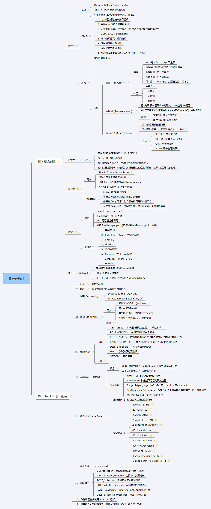

# Restful
# 前言
REST这个词，是Roy Thomas Fielding在他2000年的博士论文中提出的。现在貌似流行了起来，甚至出现过：RESTful API是目前比较成熟的一套互联网应用程序的API设计理论，作为前端设备与后端进行通信的架构，有必要好好熟悉一下。 

<!--more-->

# 几个概念对比
既然说到来了Rest，不妨说说相关的几个概念：  REST、RESTFUL、SOAP、RPC、RESTFUL Web API；  

## REST
### 概念
-  Representational State Transfer
-  REST 是一种软件架构设计风格
-  Fielding在他2000年的博士论文中提出的

### 约束条件
1.  C/S模型,通过统一接口通讯
2. 层次化,可与多个服务器通讯
3. 无状态,服务器不保存客户状态,发送请求时需包含足够信息
4. Cache,C/S之间可使用缓存
5. 唯一资源标识来标识资源
6. 传递消息的自身描述
7. 返回资源的自身描述
8. 可选的超媒体即应用状态引擎（HATEOAS）

### 解释
REST可解释为：表现层状态转化，从一下三个方面讲述

#### 资源（Resources）
#### 解读
1. REST的名称"中，省略了主语
2. 表现层"其实指的是"资源"的"表现层
3. 资源就是网络上的一个实体
4. 也是网络上的一个具体信息
5. 可以用一个URI（统一资源定位符）指向它

#### 体现
1. 一段文本
2. 一张图片
3. 一首歌曲
4. 一种服务

#### 表现层（Representation）
##### 概念
1. 把"资源"具体呈现出来的形式，叫做它的"表现层"
2. 在HTTP请求的头信息中用Accept和Content-Type字段指定

##### 体现
1. 文本可以用txt格式表现
2. 图片可以用JPG格式表现

#### 状态转化（State Transfer）
##### 概念
1. 客户端想要操作服务器
2. 通过某种手段，让服务器端发生"状态转化"

##### 体现
1. GET(GET用来获取资源)
2. POST(用来新建(更新)资源)
3. PUT(用来更新资源)
4. DELETE(用来删除资源)

## RESTFUL
1. 满足 REST 约束条件的就称为 RESTFUL
2. 每一个URI代表一种资源
3. 客户端和服务器之间，传递这种资源的某种表现层
4. 客户端通过四个HTTP动词，对服务器端资源进行操作，实现"表现层状态转化"

## SOAP
### 概念
1. Simple Object Access Protocol
2. SOAP 是简单对象访问协议
3. 是基于xml以及多种协议(http smtp mime)
4. 使用ws-security来进行安全控制

### 构建模块
1. 必需的 Envelope 元素
2. 可选的 Header 元素，包含头部信息
3. 必需的 Body 元素，包含所有的调用和响应信息
4. 可选的 Fault 元素，提供有关在处理此消息所发生错误的信息

## RPC
### 概念
1. Remote Procedure Call
2. 通过网络远程调用服务端
3. RPC 是远程过程调用
4. 可指定协议(http,tcp,udp)和传输数据格式(json,xml,二进制)

### 发展历程
1. 早期的 RPC
2. XML-RPC，SOAP，WebService
3. PHPRPC
4. Hessian
5. JSON-RPC
6. Microsoft WCF，WebAPI
7. ZeroC Ice，Thrift，GRPC
8. Hprose

## RESTFUL Web API
1. 使用HTTP并遵循REST原则的Web服务
2. URI 可以完成资源定位
3. GET、POST、OPTION等方法可以完成资源操作

# RESTful API 设计指南
## 一、协议
HTTPs协议
## 二、域名
应该尽量将API部署在专用域名之下
## 三、版本（Versioning）
 应该将API的版本号放入URL  
参考： https://api.example.com/v1/
## 四、路径（Endpoint）
### 概念
1. 路径又称"终点"（endpoint）
2. 表示API的具体网址
3. 每个网址代表一种资源（resource）
4. 网址中不能有动词，只能有名词

### 示例
https://api.example.com/v1/zoos  
https://api.example.com/v1/animals  
https://api.example.com/v1/employees   

## 五、HTTP动词
### 操作
1. GET（SELECT）：从服务器取出资源（一项或多项）
2. POST（CREATE）：在服务器新建一个资源
3. PUT（UPDATE）：在服务器更新资源（客户端提供改变后的完整资源）
4. PATCH（UPDATE）：在服务器更新资源（客户端提供改变的属性）
5. DELETE（DELETE）：从服务器删除资源
6. HEAD：获取资源的元数据
7. OPTIONS：获取信息

### 示例
1. GET /zoos：列出所有动物园
2. POST /zoos：新建一个动物园
3. GET /zoos/ID：获取某个指定动物园的信息
4. PUT /zoos/ID：更新某个指定动物园的信息（提供该动物园的全部信息）
5. PATCH /zoos/ID：更新某个指定动物园的信息（提供该动物园的部分信息）
6. DELETE /zoos/ID：删除某个动物园
7. GET /zoos/ID/animals：列出某个指定动物园的所有动物
8. DELETE /zoos/ID/animals/ID：删除某个指定动物园的指定动物

## 六、过滤信息（Filtering）
### 概念
1. 如果记录数量很多，服务器不可能都将它们返回给用户
2. API应该提供参数，过滤返回结果

### 常见参数
1. ?limit=10：指定返回记录的数量
2. ?offset=10：指定返回记录的开始位置
3. ?page=2&per_page=100：指定第几页，以及每页的记录数
4. ?sortby=name&order=asc：指定返回结果按照哪个属性排序，以及排序顺序
5. ?animal_type_id=1：指定筛选条件

## 七、状态码（Status Codes）
服务器向用户返回的状态码和提示信息  
### 常见状态码
1. 200 OK - [GET]：服务器成功返回用户请求的数据，该操作是幂等的（Idempotent）
2. 201 CREATED - [POST/PUT/PATCH]：用户新建或修改数据成功。
3. 202 Accepted - [*]：表示一个请求已经进入后台排队（异步任务）
4. 204 NO CONTENT - [DELETE]：用户删除数据成功
5. 400 INVALID REQUEST - [POST/PUT/PATCH]：用户发出的请求有错误，服务器没有进行新建或修改数据的操作，该操作是幂等的。
6. 401 Unauthorized - [*]：表示用户没有权限（令牌、用户名、密码错误）。

## 八、错误处理（Error handling）
## 九、返回结果
1. GET /collection：返回资源对象的列表（数组）
2. GET /collection/resource：返回单个资源对象
3. POST /collection：返回新生成的资源对象
4. PUT /collection/resource：返回完整的资源对象
5. PATCH /collection/resource：返回完整的资源对象
6. DELETE /collection/resource：返回一个空文档

## 10、身份认证应该使用OAuth 2.0框架
## 11、服务器返回的数据格式，应该尽量使用JSON，避免使用XML

# 思维导图

