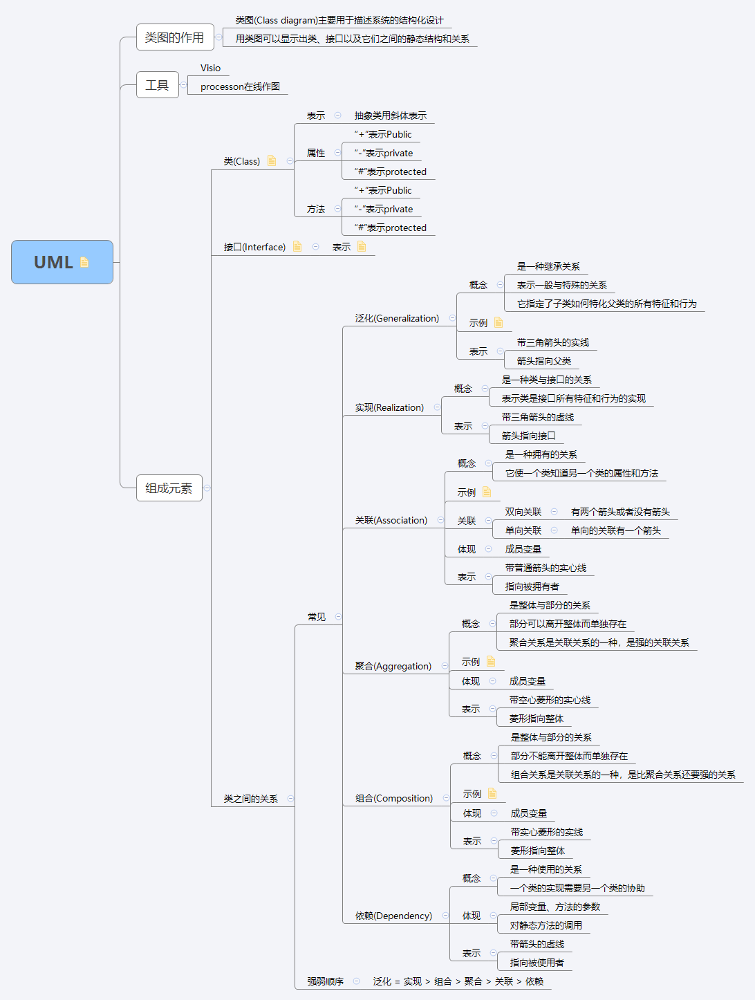

# UML类图
## 类图的作用
1. 类图(Class diagram)主要用于描述系统的结构化设计
2. 用类图可以显示出类、接口以及它们之间的静态结构和关系

## 工具
1. Visio
2. processon在线作图

## 组成元素
### 类(Class)
#### 表示
抽象类用斜体表示
#### 属性
1. “+”表示Public
2. “-”表示private
3. “#”表示protected

#### 方法
1. “+”表示Public
2. “-”表示private
3. “#”表示protected

### 接口(Interface)
在UML中，接口使用一个带有名称的小圆圈来进行表示。
### 类之间的关系
#### 常见关系
##### 泛化(Generalization)
1. 概念
2. 示例
3. 表示

##### 实现(Realization)
1. 概念
2. 表示

##### 关联(Association)
1. 概念
2. 示例
3. 关联
4. 体现
5. 表示

##### 聚合(Aggregation)
1. 概念
2. 体现
3. 表示

##### 组合(Composition)
1. 概念
2. 体现
3. 表示

##### 依赖
1. 概念
2. 体现
3. 表示

#### 强弱顺序
泛化 = 实现 > 组合 > 聚合 > 关联 > 依赖

# 思维导图

