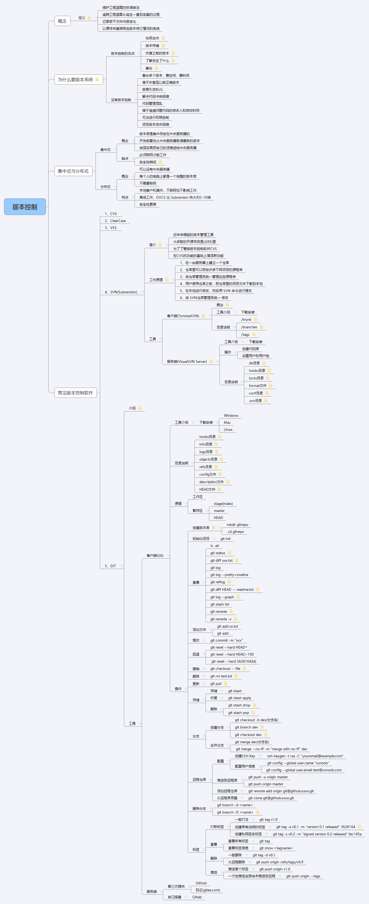

# 版本控制
## 概念
1. 维护工程蓝图的标准做法
2. 追踪工程蓝图从诞生一直到定案的过程
3. 记录若干文件内容变化
4. 以便将来查阅特定版本修订情况的系统

## 为什么要版本系统
### 版本控制的优点
1. 协同合作
2. 版本存储
3. 恢复之前的版本
4. 了解发生了什么
5. 备份

### 没有版本控制
1. 备份多个版本，费空间，费时间
2. 难于恢复至以前正确版本
3. 容易引发BUG
4. 解决代码冲突困难
5. 代码管理混乱
6. 难于追溯问题代码的修改人和修改时间
7. 无法进行权限控制
8. 项目版本发布困难

## 集中式与分布式
### 集中式
#### 概念
1. 版本库是集中存放在中央服务器的
2. 开发前要先从中央服务器取得最新的版本
3. 完成后再把自己的活推送给中央服务器

#### 缺点
1. 必须联网才能工作
2. 安全性稍低

### 分布式
#### 概念
1. 可以没有中央服务器
2. 每个人的电脑上都是一个完整的版本库
3. 不需要联网

#### 特点
1. 本地客户机操作，不联网也不影响工作
2. 离线工作，DVCS 比 Subversion 快大约3-10倍
3. 安全性更高

## 常见版本控制软件
1. CVS
2. ClearCase   
3. VSS
4. SVN(Subversion)  
5. GIT  

# 思维导图

